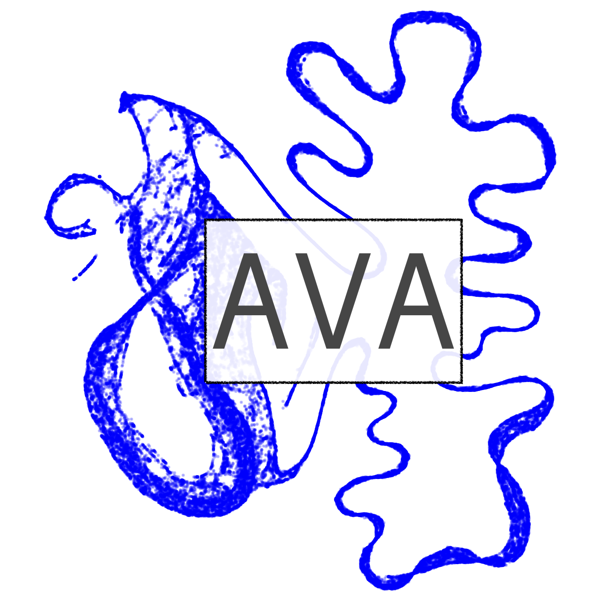

## Autoencoded Vocal Analysis v0.3.1
#### Modeling animal vocalizations with VAEs



See our article for details:

> Goffinet, J., Brudner, S., Mooney, R., & Pearson, J. (2021). Low-dimensional learned feature spaces quantify individual and group differences in vocal repertoires. *eLife*, 10:e67855. [https://doi.org/10.7554/eLife.67855](https://doi.org/10.7554/eLife.67855)

See `examples/` for usage.

See [readthedocs](https://autoencoded-vocal-analysis.readthedocs.io/en/latest/index.html)
for documentation and a tutorial.

#### To build:
```
$ git clone https://github.com/pearsonlab/autoencoded-vocal-analysis
$ cd autoencoded-vocal-analysis
$ pip install .
```

#### Dependencies:
* [Python3](https://www.python.org/) (3.5+)
* [PyTorch](https://pytorch.org)
* [UMAP](https://umap-learn.readthedocs.io/)
* [affinewarp](https://github.com/ahwillia/affinewarp)

Issues and pull requests are appreciated!

#### See also:
* [Animal Vocalization Generative Network](https://github.com/timsainb/AVGN), a
	nice repo by Tim Sainburg for clustering birdsong syllables and generating
	syllable interpolations.
* [DeepSqueak](https://github.com/DrCoffey/DeepSqueak) and
	[MUPET](https://github.com/mvansegbroeck/mupet), MATLAB packages for
	detecting and classifying rodent ultrasonic vocalizations.
* [Sound Analysis Pro](http://www.soundanalysispro.com/), software for analyzing
	birdsong.
